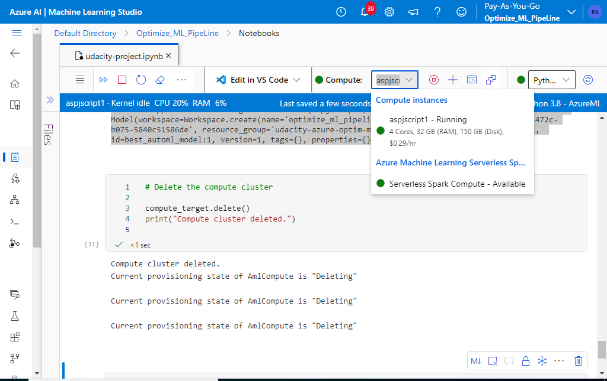

# Optimizing an ML Pipeline in Azure

## Overview
This project is part of the Udacity Azure ML Nanodegree.
In this project, we build and optimize an Azure ML pipeline using the Python SDK and a provided Scikit-learn model.
This model is then compared to an Azure AutoML run.

## Useful Resources
- [ScriptRunConfig Class](https://docs.microsoft.com/en-us/python/api/azureml-core/azureml.core.scriptrunconfig?view=azure-ml-py)
- [Configure and submit training runs](https://docs.microsoft.com/en-us/azure/machine-learning/how-to-set-up-training-targets)
- [HyperDriveConfig Class](https://docs.microsoft.com/en-us/python/api/azureml-train-core/azureml.train.hyperdrive.hyperdriveconfig?view=azure-ml-py)
- [How to tune hyperparamters](https://docs.microsoft.com/en-us/azure/machine-learning/how-to-tune-hyperparameters)

## Summary
**Problem Statement**:
This dataset contains data about bank marketing campaigns. We seek to predict whether a client will subscribe to a term deposit based on various attributes such as job, marital status, education, default, housing, loan, contact, month, day of the week, and previous campaign outcome.

**Solution**:
The best performing model was an AutoML-generated model with an accuracy of approximately 0.9176, outperforming the manually tuned Scikit-learn Logistic Regression model which achieved an accuracy of approximately 0.9089.

## Scikit-learn Pipeline
**Pipeline Architecture**:
The pipeline involves:
1. Creating a compute cluster using Azure ML.
2. Configuring HyperDrive for hyperparameter tuning of a Logistic Regression model.
3. Splitting the data into training and testing sets.
4. Training the model and logging metrics.
5. Saving the best model from HyperDrive.

**Parameter Sampler**:
The Random Parameter Sampling strategy was used, sampling the `--C` hyperparameter from a uniform distribution between 0.01 and 10 and the `--max_iter` hyperparameter from a choice of [50, 100, 150]. This method ensures a broad exploration of the hyperparameter space.

**Early Stopping Policy**:
The Bandit Policy was chosen with an evaluation interval of 2 and a slack factor of 0.1. This policy terminates underperforming runs early, saving computational resources and time by focusing on promising hyperparameter configurations.

## AutoML
**Model and Hyperparameters**:
AutoML configured various models to optimize accuracy for the classification task. The final best model was an ensemble with an accuracy of approximately 0.9176. AutoML performed tasks such as feature engineering, hyperparameter tuning, and model selection.

## Pipeline Comparison
**Performance Comparison**:
- The HyperDrive-tuned Logistic Regression model achieved an accuracy of 0.9089.
- The AutoML model achieved an accuracy of 0.9176.

**Differences**:
The AutoML model outperformed the manually tuned Logistic Regression model. AutoML's automated feature engineering and model selection processes contributed to this higher accuracy. Additionally, AutoML explored a wider range of algorithms and hyperparameters, leading to better performance.

## Future Work
**Improvements**:
- Address class imbalance by using techniques such as SMOTE (Synthetic Minority Over-sampling Technique) to improve model performance.
- Extend AutoML run time and iterations to explore more models and hyperparameter combinations.
- Experiment with other feature engineering techniques and algorithms not included in the initial runs.
- Investigate ensemble methods further to potentially enhance the model's robustness and accuracy.

## Proof of Cluster Clean-Up
The compute cluster used for training was deleted to avoid unnecessary charges.

**Image of Cluster Deletion**:

